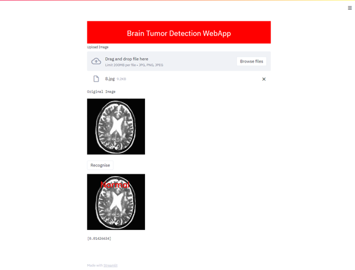
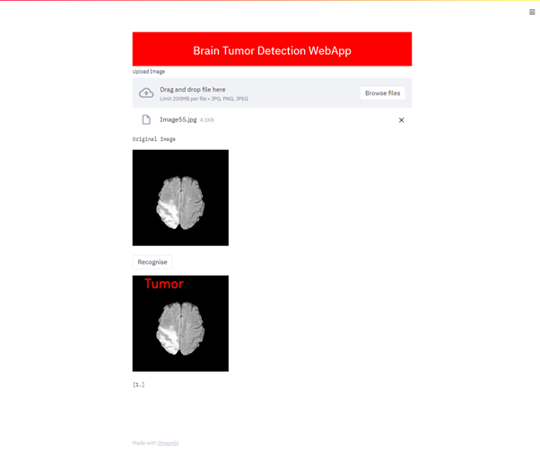

# Brain_Tumor_Detection
Deep learning model to classify brain MRI images into tumor and non-tumor

Tensorflow Version on both colab(for training and testing purpose) and pycharm(for deployment) : 2.2.0

### Setting up folders
1. Create a folder in your drive : Brain_Tumor_Classification
2. Create 3 subfolders : input, models, src
    1. input :
        1. brain_tumor_dataset : The dataset folder (needs to be manually uploaded)
        2. new_brain_tumor_dataset : (Just create an empty folder by this name; the files will be uploaded by the code)
        3. Final_brain_tumor_dataset : (Just create an empty folder by this name; the files will be uploaded by the code)
    2. models :
        (Just create an empty folder by this name; the files will be uploaded by the code)
    3. src :
        1. \_\_init\_\_.py : Create an empty file by this name only(don't change the file name)
        2. Brain_Tumor_Detection.ipynb
        3. constants.py : (Download the .py version of constants.ipynb as .py has to be imported in the Brain_Tumor_Detection.ipynb file)

### Deploy on webapp
1. Pip install streamlit
2. Use the deploy.py code on your local computer and put the model file in the same directory.
3. Create an empty folder called Test in the same directory where the deploy.py and model files are stored. It will contain 2 subfolders yes and no. The test image uploaded on the webapp will be uploaded in the yes subfolder.(We don't need to care whether it really has a tumor or not. The folder just needs to follow the ImageDataGenerator hierarchy)
4. Make sure of the python libraries' versions given in the versions section below
5. Run the code on the command prompt by the following command:
streamlit run deploy.py
(Make sure to first be in that directory on the command prompt by using the cd command)
The webapp should get opened in a new tab on your search engine.

Normal Image          |  Tumor Image
:-------------------------:|:-------------------------:
  |  
### Versions
1. streamlit - 0.79.0
2. tensorboard - 2.4.1
3. tensorflow-plugin-wit - 1.8.0
4. tensorflow
- Pycharm - 2.4.1
- Colab - 2.2.0
5. tensorflow-estimator - 2.4.0
6. Keras - 2.4.3
7. Keras-Preprocessing - 1.1.2
8. Pillow - 8.1.0
9. numpy - 1.19.5
10. opencv-python - 4.5.1.48
11. pip - 20.3.3
12.
